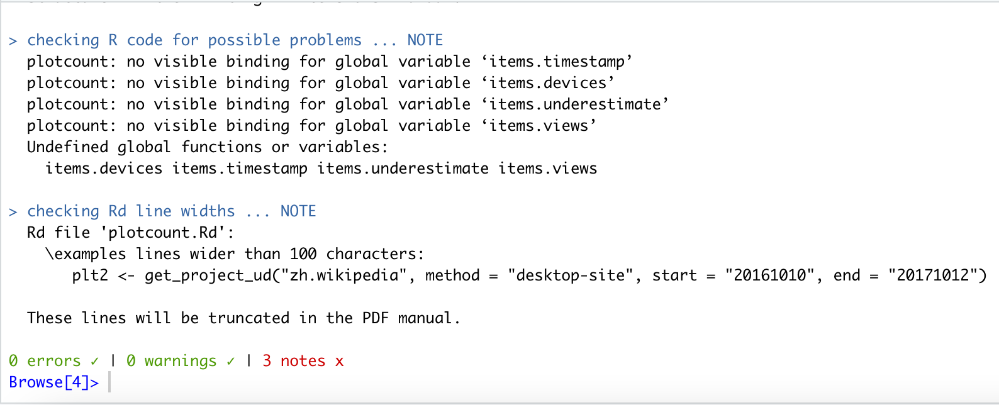
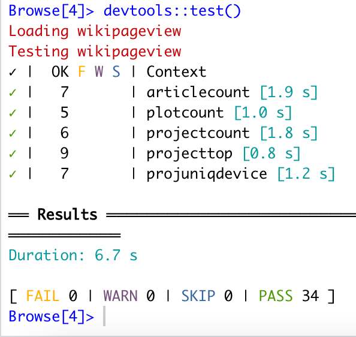
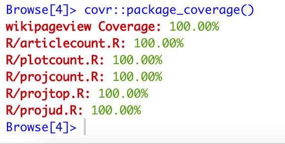

# Contribution/expected workflow

## Start
1. Generate basic ideas about the project through Zoom meetings.
2. Discuss functions through Wechat/Zoom whenever all team members have time.

## Procedure
1. Ceate our repository.
2. After ideas about functions are finalized(mainly from Haotian Jin), split the work into two. Since both of us writing on code at the the same time will produce chaos. 

- One will initiate the package and write all functions and tests(fulfilled by **Fengcheng Liu**).
Wrap up functions(R script) includes get the article page view count from API request, project view count, project top ranking, project unique device count and the plot function for 4 above API wrap up function. The check result have no error and warning

Test file(R script) includes 5 distinct tests for each function and all tests were passed with the coverage 100% for for corresponding function(R script)

- Another one will proofread the code and test code(fulfill by **Haotian Jin**) and make sure all tests were passed with the coverage 100% for for corresponding function(R script) 

Then write code of conduct and vignette. 
- Contribution are compiled by team members together - **Haotian Jin & Fengcheng Liu**
3. Progress will be communicated through Wechat/Zoom once update.

## End
1. Final discussion will take place. A zoom meeting would be expected. Each team member will take a look at others' work. Understand and modify each others' work.
2. Final correction and submission.